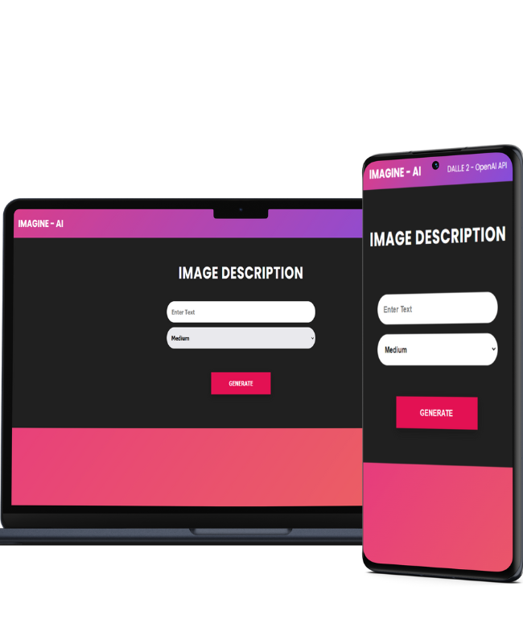

# Imagine_AI

<br>

<h3>"IMAGINE - AI: Unleashing the power of DALL-E 2 to generate stunning, one-of-a-kind images."</h3>
The IMAGINE - AI, which is built using the OpenAI API library DALL-E 2, aims to solve the problem of limited creativity and imagination. This is a fully mobile responsive image generator built with Node.js and Express that uses [OpenAI's Dall-E models](https://beta.openai.com/docs/guides/images) to generate images.

<p align="center">
  
</p>

## Video Demo:
<h4> YouTube: https://www.youtube.com/watch?v=FR3i1GmtiEA </h4>
<br>

# Technologies used
1) Node JS
2) Express JS
3) Javascript
4) HTML
5) CSS
6) OpenAI API
7) Postman


# How to use the project

Create a file named `.env`.

Generate an API KEY at [OpenAI](https://beta.openai.com/) and add it to the `.env` file.

Install the dependencies

```bash
npm install
```

Run server

```bash
npm start
```

Visit `http://localhost:5000` in your browser.

The endpoint is at `POST http://localhost:5000/openai/generateimage`.

<hr>

<h4> Live Site: https://imagine-ai-fice.vercel.app/  </h4>
<br>
(Currently backend facing some deployment issues because of the API so image may not be generated will fix this soon ,  Frontend working fine)
