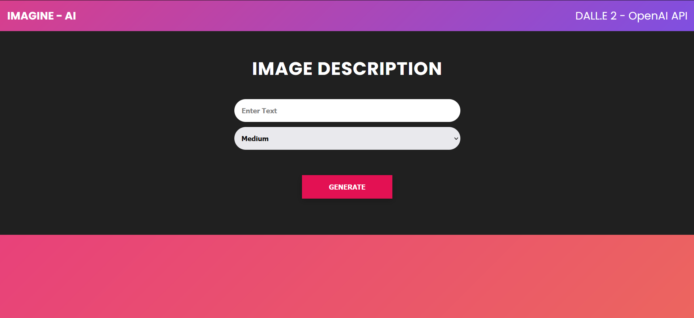

# Imagine_AI

<br>

<h3>"IMAGINE - AI: Unleashing the power of DALL-E 2 to generate stunning, one-of-a-kind images."</h3>
The IMAGINE - AI, which is built using the OpenAI API library DALL-E 2, aims to solve the problem of limited creativity and imagination. This is a simple image generator built with Node.js and Express that uses [OpenAI's Dall-E models](https://beta.openai.com/docs/guides/images) to generate images.

<p align="center">
  
</p>

<br>


## Usage

Rename the `example.env` file to `.env`.

Generate an API KEY at [OpenAI](https://beta.openai.com/) and add it to the `.env` file.

Install the dependencies

```bash
npm install
```

Run server

```bash
npm start
```

Visit `http://localhost:5000` in your browser.

The endpoint is at `POST http://localhost:5000/openai/generateimage`.
